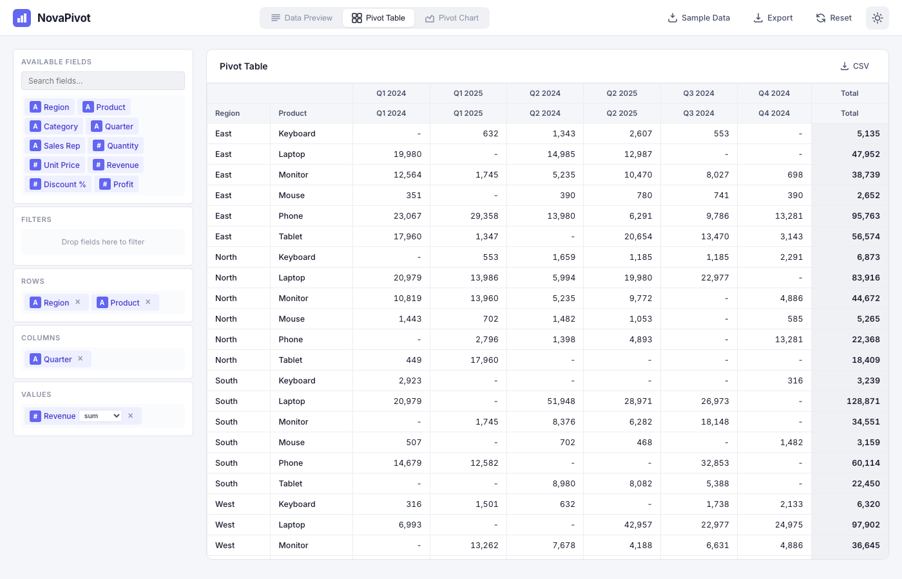

<div align="center">

# NovaPivot

[](https://developer.mozilla.org/en-US/docs/Web/HTML)
[](https://developer.mozilla.org/en-US/docs/Web/CSS)
[](https://developer.mozilla.org/en-US/docs/Web/JavaScript)
[](LICENSE)

**A modern, sleek pivot table and chart analytics dashboard built with vanilla HTML, CSS, and JavaScript.**

[Live Demo](https://alfredang.github.io/novapivot/) · [Report Bug](https://github.com/alfredang/novapivot/issues) · [Request Feature](https://github.com/alfredang/novapivot/issues)

</div>

---

## Screenshot



## About

NovaPivot is a browser-based analytics tool that lets users upload CSV data and instantly build interactive pivot tables and charts using an intuitive drag-and-drop interface. Inspired by the pivot exploration experience of PivotTable.js and the polished dashboard aesthetic of NovaSPC, it delivers a professional analytics experience with zero dependencies.

### Key Features

| Feature | Description |
|---------|-------------|
| **CSV Upload** | Drag-and-drop or browse file upload with auto-detection of delimiters and column types |
| **Pivot Table Builder** | Drag-and-drop fields into Rows, Columns, Values, and Filters zones |
| **6 Aggregations** | Sum, Count, Average, Min, Max, and Distinct Count |
| **6 Chart Types** | Bar, Stacked Bar, Line, Area, Pie, and Heatmap |
| **Dark / Light Theme** | Toggle between themes with localStorage persistence |
| **Export** | Export pivot tables as CSV and charts as PNG |
| **Sample Data** | Built-in 200-row sales dataset for instant demos |
| **Responsive** | Works on desktop and tablet with adaptive layout |
| **Sorting & Filtering** | Sort pivot columns and filter by field values |
| **Totals** | Automatic row totals, column totals, and grand totals |

## Tech Stack

| Category | Technology |
|----------|-----------|
| **Markup** | HTML5 |
| **Styling** | CSS3 with CSS Custom Properties (dark/light theming) |
| **Logic** | Vanilla JavaScript (ES6+ modules) |
| **Charts** | Canvas API (custom-built, no libraries) |
| **Fonts** | [Inter](https://fonts.google.com/specimen/Inter) via Google Fonts |
| **Deployment** | GitHub Pages |

## Architecture

```
┌─────────────────────────────────────────────────┐
│                   Browser UI                     │
│  ┌───────────┬──────────────┬────────────────┐  │
│  │  Upload   │  Data Table  │  View Tabs     │  │
│  │  Zone     │  Preview     │  (Data/Pivot/  │  │
│  │           │              │   Chart)       │  │
│  └───────────┴──────────────┴────────────────┘  │
│                      │                           │
│  ┌──────────────────────────────────────────┐   │
│  │          Drag-and-Drop Builder            │   │
│  │  Fields → Rows / Columns / Values /       │   │
│  │           Filters                         │   │
│  └──────────────────────────────────────────┘   │
│         │                        │               │
│  ┌──────┴──────┐        ┌───────┴───────┐       │
│  │ Pivot Engine│        │ Chart Renderer │       │
│  │ (pivot.js)  │        │ (charts.js)   │       │
│  │             │        │ Canvas API    │       │
│  └──────┬──────┘        └───────────────┘       │
│         │                                        │
│  ┌──────┴──────┐                                │
│  │ CSV Parser  │  ← csv.js                      │
│  │ Type Detect │                                │
│  └─────────────┘                                │
└─────────────────────────────────────────────────┘
```

## Project Structure

```
novapivot/
├── index.html          # Main HTML layout and structure
├── styles.css          # Full styling with dark/light CSS variables
├── app.js              # Application orchestration and event wiring
├── csv.js              # CSV parsing, type detection, sample data
├── pivot.js            # Pivot table computation engine
├── charts.js           # Canvas-based chart rendering (6 types)
├── theme.js            # Dark/light theme management
├── ui.js               # Drag-and-drop, toasts, field chips, filters
├── screenshot.png      # App screenshot for README
└── README.md           # Project documentation
```

## Getting Started

### Prerequisites

- A modern web browser (Chrome, Firefox, Safari, Edge)
- No build tools, servers, or dependencies required

### Installation

1. **Clone the repository**
   ```bash
   git clone https://github.com/alfredang/novapivot.git
   cd novapivot
   ```

2. **Open in browser**
   ```bash
   open index.html
   ```
   Or simply double-click `index.html` in your file manager.

### Usage

1. **Upload Data** — Drop a CSV file onto the upload zone or click "Browse Files". You can also click "Load Sample Data" for a quick demo.
2. **Preview** — Review your data in the Data Preview tab.
3. **Build Pivot** — Switch to the Pivot Table tab and drag fields from Available Fields into Rows, Columns, Values, and Filters zones.
4. **Choose Aggregation** — Click the aggregation dropdown on value fields to switch between Sum, Count, Average, Min, Max, or Distinct Count.
5. **View Charts** — Switch to the Pivot Chart tab and select from 6 chart types.
6. **Export** — Export the pivot table as CSV or the chart as PNG using the export buttons.
7. **Toggle Theme** — Click the sun/moon icon to switch between light and dark mode.

## Deployment

### GitHub Pages

This project is deployed automatically via GitHub Actions. Simply push to the `main` branch and the site will be live at:

```
https://alfredang.github.io/novapivot/
```

### Self-Hosting

Since NovaPivot is fully client-side, you can host it on any static file server:

```bash
# Using Python
python3 -m http.server 8080

# Using Node.js
npx serve .
```

## Contributing

Contributions are welcome! Here's how:

1. **Fork** the repository
2. **Create** a feature branch (`git checkout -b feature/amazing-feature`)
3. **Commit** your changes (`git commit -m 'Add amazing feature'`)
4. **Push** to the branch (`git push origin feature/amazing-feature`)
5. **Open** a Pull Request

For questions or ideas, open a [Discussion](https://github.com/alfredang/novapivot/discussions).

---

<div align="center">

### Developed by [Alfred Ang](https://github.com/alfredang)

#### Acknowledgements

- Interaction model inspired by [PivotTable.js](https://github.com/nicolaskruchten/pivottable)
- Visual design inspired by [NovaSPC](https://github.com/alfredang/novaspc)
- Typography by [Inter](https://rsms.me/inter/)

---

If you found this useful, please consider giving it a ⭐

</div>
